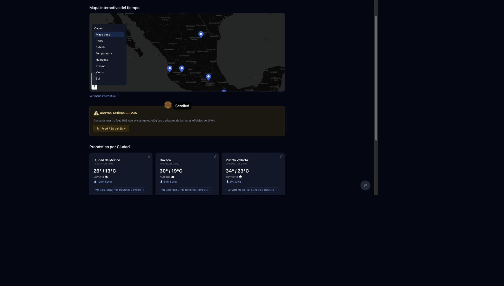

<div align="center">

# Clima México 🇲🇽

**Mapa interactivo del clima estilo zoom.earth — Open-Meteo + SMN, sin API keys, sin cookies, sin backend.**

[](https://artemiop.com/mexico-weather/)
[](https://astro.build)
[](https://tailwindcss.com)
[](https://maplibre.org)
[](#license)



[**🌎 Probar en vivo**](https://artemiop.com/mexico-weather/) · [📖 Guía de usuario](docs/USER_GUIDE.md) · [🧪 E2E journeys](docs/USER_JOURNEYS.md)

</div>

---

## ¿Qué hace?

Un dashboard del clima enfocado en México con tres páginas y cero servidor:

| Página | Qué muestra |
|---|---|
| **`/`** Inicio | Mapa interactivo embebido (400 px) · 5 tarjetas preset de ciudades (CDMX, GDL, MTY, PV, Oaxaca) · favoritos · búsqueda + geolocalización · feed RSS de avisos del SMN. |
| **`/forecast`** Detalle | Pronóstico actual + 48 h por hora + 7 días + paneles (viento, UV, cielo y aire) · mapa embebido centrado en la ubicación con capa Temperatura activa · botón `Compartir` (Web Share API + clipboard fallback) · favoritos. |
| **`/mapa`** Mapa completo | MapLibre full-screen · 7 capas (mapa base, radar, satélite, temperatura, humedad, presión, viento, sol) · slider de opacidad · timeline scrubber · search con autocompletado MX-aware. |

---

## Lo interesante

### 🌡️ Capas de campo continuo (estilo zoom.earth)

Las capas de **temperatura, humedad y presión** no son puntos en un grid — se renderean como un **raster continuo generado client-side** por bilinear interpolation entre 70 puntos sample de Open-Meteo. El raster (400×280 px) se upsamplea con `raster-resampling: linear` de MapLibre, lo que produce un gradiente isotérmico suave que cubre todo el viewport. Sin tile server, sin API key.

Ver [`src/lib/mapraster.ts`](src/lib/mapraster.ts) para la implementación.

### 🌪️ Capa de viento con partículas WebGL

El viento usa un **WebGL custom layer** con shader propio que advecta partículas por el campo de viento de Open-Meteo. Bajo `prefers-reduced-motion: reduce` cae graciosamente a marcadores estáticos circulares.

### 🌒 Terminador día/noche

La capa de Sol calcula la posición subsolar a tiempo real y dibuja el terminador como un polígono de dos tiers (banda twilight + noche profunda), con opacidad reducida automáticamente en zooms mundiales para evitar artefactos de Mercator.

### ⚡ Sin API keys

Todas las fuentes son públicas y CORS-enabled:

- **Open-Meteo** (gridded forecast: temperatura, humedad, presión, viento)
- **RainViewer** (radar + satélite-IR)
- **OpenStreetMap** (basemap claro)
- **CartoDB Dark Matter** (basemap oscuro)
- **SMN / CONAGUA** (avisos meteorológicos vía RSS, refrescado por GitHub Actions)

### 🎨 Detalles de UX

- **Sticky topbar** con brand 🇲🇽 + nav + theme toggle (Sistema/Claro/Oscuro).
- **Dark basemap automático** — CartoDB Dark Matter en tema oscuro, OSM standard en claro, con swap dinámico via `MutationObserver`.
- **Cache compartida** in-memory con TTL de 10 min + request coalescing para no saturar Open-Meteo.
- **Skeleton states** con `animate-pulse` mientras carga.
- **Favorites dedupe** — un preset que ya está en favoritos no se duplica.
- **Forecast con todo**: timestamp con timezone, botón Compartir, star bigger touch target, hourly cards con color tint por temperatura, 7-día con axis labels y today marker, Detalle con iconos 🧭 ☀️ ☁️.

---

## URL schemas

`/mapa` y `/forecast` son completamente bookmarkable:

```
/mapa#view=19.43,-99.13,6.5z&layer=radar&t=2026-05-19T13:00:00.000Z
/forecast?lat=19.43&lng=-99.13&name=Ciudad%20de%20M%C3%A9xico&tz=America%2FMexico_City
```

El hash del mapa preserva centro, zoom, capa activa y frame del timeline. Recarga = misma vista.

---

## Stack

- **Astro 6** static site (deploy a GitHub Pages)
- **Tailwind CSS 4** (mobile-first, dark-mode-aware)
- **TypeScript** estricto
- **MapLibre GL JS** (lazy-loaded — sólo en páginas con mapa)
- **Vitest** (unit) + **Playwright** (e2e, 31 specs)
- **GitHub Actions** (CI + Pages deploy + SMN RSS refresh horario)

## Desarrollo local

```bash
npm install
npm run dev
```

Scripts útiles:

| Comando | Qué hace |
|---|---|
| `npm run dev` | Servidor de desarrollo |
| `npm run check` | Astro diagnostics (TS + componentes) |
| `npm run build` | Build estático a `dist/` |
| `npm run preview` | Preview del build de producción |
| `npm test` | Vitest unit suite (173 tests) |
| `npm run test:e2e` | Playwright e2e suite (31 tests) |
| `npm run lint` / `npm run format` | ESLint + Prettier |

Hooks de pre-commit (Husky) corren `eslint --fix` sobre los archivos staged.

## Estructura

```text
src/
  pages/
    index.astro           # home (cards + búsqueda + mapa embebido)
    forecast.astro        # detalle shareable (URL-driven) con mapa embebido
    mapa.astro            # mapa interactivo full-screen
    privacidad.astro
    rss.xml.ts            # SMN advisories feed (build-time)
    sitemap.xml.ts
  layouts/BaseLayout.astro
  components/
    InteractiveMap.astro  # wrapper Astro del mapa reusable
    common/               # FeedbackFAB, ThemeToggle
  lib/
    interactive-map.ts    # factory MapLibre (capas, layer rail, timeline,
                          #   search, opacity, cache, first-paint nudges)
    mapraster.ts          # bilinear interpolation + canvas → raster image
    mapfields.ts          # color ramps + viewport grid + bulk URL builder
    mapwind.ts            # WebGL particle layer
    mapsun.ts             # terminador día/noche
    mappins.ts · maplayers.ts · maptimeline.ts · maphash.ts
    weather.ts · forecast.ts · geocode.ts · theme.ts · rss.ts
  i18n/ui.ts              # Spanish-first + English strings
  data/cities.ts          # preset MX cities (CDMX, GDL, MTY, PV, Oaxaca, ...)
  utils/paths.ts

e2e/                      # Playwright specs (mapa, forecast, home, cross, static, ...)
docs/
  USER_GUIDE.md           # tour de features + URL schemas + a11y
  USER_JOURNEYS.md        # ~51 journeys e2e-shaped (selectores estables, mocks)
  assets/demo.gif         # ← arriba
public/
  sw.js                   # SW de aislamiento de scope (sin cache — ver comment)
```

## Privacidad

- **Sin cookies**, sin analytics, sin tracking.
- **Sin cuentas** — los favoritos se guardan en `localStorage`.
- **Sin servidor propio** — los fetches van del navegador del usuario directo a Open-Meteo / RainViewer / OSM.
- Ver [`/privacidad`](https://artemiop.com/mexico-weather/privacidad/) para el detalle.

## Herramientas adicionales

- **Skill de agente Claude** en `skill/SKILL.md` (ciudades, algoritmo de ventana de lluvia, interpretación SMN/WMO).
- **CLI Python stdlib-only** en `scripts/weather_mx.py` — `python3 scripts/weather_mx.py "CDMX"`.
- **SMN RSS auto-refresh** vía `.github/workflows/smn-rss.yml` cada hora desde `scripts/smn-rss/smn_rss.py`.

## Deployment

Deploy automático a GitHub Pages desde `main`. Astro `base` configurado como `/mexico-weather`. CI completo (Build & Check, Playwright, Lighthouse, GitGuardian) bloquea merges con regresiones.

Ver `SETUP.md` para detalles de environment.

## License

MIT
